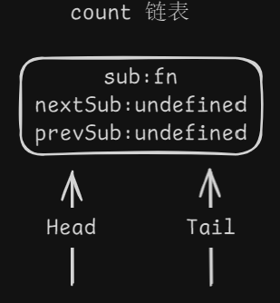
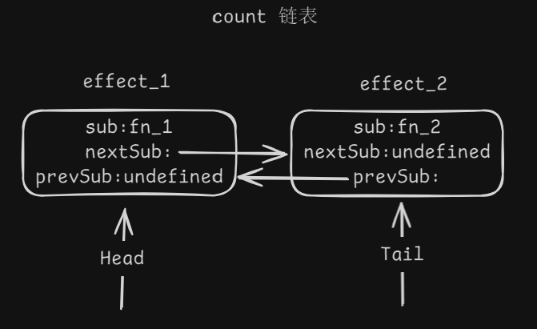
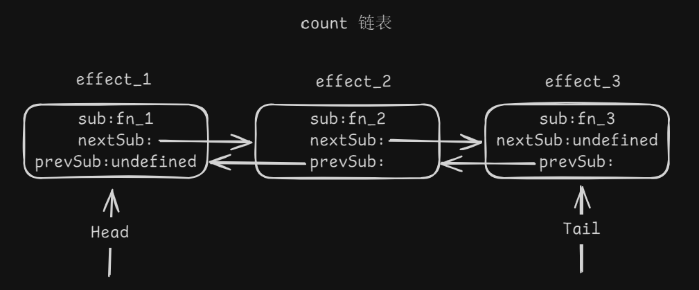

# Vue 响应式

本文将从 0 开始搭建 `Vue` 的响应式系统，实现 `ref`，`effect`，`computed`，`watch` 等

## ref 与 effect

**需要解决的问题：**

1. 实现 `ref` 的 `getter` 与 `setter`
2. 实现订阅 `ref` 中的值，并执行 `effect` 中的函数
3. 当有多个 `effect` 订阅事件时，使用双向链表保存事件
4. 当有嵌套的 `effect` 订阅事件时，正常运行
5. 当有多个 `ref` 时，使用链表复用覆盖事件

**首先完成前两个最基础的功能**

::: code-group

```html [demo.html]
<!DOCTYPE html>
<html lang="en">
<head>
  <meta charset="UTF-8">
  <title>Title</title>
</head>
<body>
<script type="module">
  import { ref, effect } from '../dist/reactivity.esm.js'

  // 1.1 注册响应式数据
  const count = ref(0)

  // 2.1 注册订阅者
  effect(() => {
    console.log('count.value ==> ', count.value)
  })

  setTimeout(() => {
    // 3.1 修改 ref 的值，触发 get
    count.value = 1
  }, 1000)
</script>
</body>
</html>
```

```ts [effect.ts]
// 临时需要执行的订阅事件
export let activeSub: Function

/**
 * 订阅 ref
 * @param fn
 * @param options
 */
export function effect<T = any>(fn: () => T, options?: any) {
  // 2.2 保存产生副作用函数，并暴露给 ref
  activeSub = fn
  // 2.3 执行函数，产生副作用，调用 ref 的 get
  activeSub()
  // 2.5 清空临时订阅事件
  activeSub = undefined
}

```

```ts [ref.ts]
import { activeSub } from './effect'

class RefImpl<T = any> {
  _value: T

  // 自己的订阅事件
  sub: Function

  constructor(value: T) {
    // 1.3 设置初始值
    this._value = value
  }

  get value() {
    // 2.4 将临时订阅事件保存到自己的 ref 中
    if (activeSub) {
      this.sub = activeSub
    }
    return this._value
  }

  set value(newValue) {
    // 3.2 执行自己 ref 中的订阅事件
    this._value = newValue
    this.sub()
  }
}

export function ref(value: unknown) {
  // 1.2 创建并返回新的 ref 实例
  return new RefImpl(value)
}
```

:::

可当我们有两个订阅事件 `effect` 时

由于每个 `ref` 中的 `sub` 只能保留一个订阅事件，因此会覆盖前面的订阅事件，只会执行最后的

::: code-group

```html [demo.html]
<script type="module">
  import { ref, effect } from '../dist/reactivity.esm.js'

  const count = ref(0)

  effect(() => {
    console.log('count.value ==> ', count.value)
  })
  effect(() => {
    console.log('count.value ==> ', count.value)
  })

  setTimeout(() => {
    count.value = 1
  }, 1000)
</script>
```

```js [期望输出]
count.value ==> 0
count.value ==> 0
count.value ==> 1
count.value ==> 1
```

```js [实际输出]
count.value ==> 0
count.value ==> 0
count.value ==> 1
```

:::

所以我们需要保存所有的订阅者事件，这时可以用数组来保存，但使用链表来保存可以提高性能

### 双向链表

1. 当我们定义第一个 `effect` 时，创建初始链表的头节点，`sub ` 中存副作用函数，`nextSub` 下一个节点和 `prevSub` 尾节点为 `undefined`



2. 当我们定义第二个 `effect` 时，将头节点的 `nextSub` 指向新的节点，新节点的 `prevSub` 指向旧节点，最后将链表的 `Tail` 指向新节点



3. 以此类推



于是，我们修改 `RefImpl` 将原先接受函数的 `sub` 修改为 `subsHead` 添加 `subsTail`，并实现链表

::: code-group

```ts [ref.ts]
import { activeSub } from './effect'
import { Link, link, propagate } from './system'

export class RefImpl<T = any> {
  _value: T

  // 订阅者链表的头节点
  subsHead: Link

  // 订阅者链表的尾节点
  subsTail: Link

  constructor(value: T) {
    this._value = value
  }

  get value() {
    trackRef(this)
    return this._value
  }

  set value(newValue) {
    this._value = newValue
    triggerRef(this)
  }
}

export function ref(value: unknown) {
  return new RefImpl(value)
}

/**
 * 添加节点
 * @param dep
 */
export function trackRef(dep: RefImpl) {
  if (activeSub) link(dep, activeSub)
}

/**
 * 触发 ref 关联的所有 effect
 * @param dep
 */
export function triggerRef(dep: RefImpl) {
  if (dep.subsHead) {
    propagate(dep.subsHead)
  }
}
```

```ts [system.ts]
import { RefImpl } from './ref'

/**
 * 链表节点
 */
export interface Link {
  // 保存 订阅事件
  sub: Function
  // 下一个节点
  nextSub: Link | undefined
  // 上一个节点
  prevSub: Link | undefined
}

/**
 *
 * @param dep 当前的 ref
 * @param sub 临时订阅事件
 */
export function link(dep: RefImpl, sub: Function) {
  // 新建节点
  const newLink: Link = {
    sub,
    nextSub: undefined,
    prevSub: undefined,
  }

  // 将节点放入本 ref 的订阅者链表中
  if (dep.subsTail) {
    // 如果有尾节点 => 不是头节点 => 在链表后面加入
    dep.subsTail.nextSub = newLink
    newLink.prevSub = dep.subsTail
    dep.subsTail = newLink
  } else {
    // 如果无尾节点 => 是头节点 => 设置为头节点
    dep.subsHead = newLink
    dep.subsTail = newLink
  }
}

/**
 * 传播更新的函数
 * @param subs
 */
export function propagate(subs: Link) {
  let link = subs
  let queuedEffect = []
  while (link) {
    queuedEffect.push(link.sub)
    link = link.nextSub
  }
  queuedEffect.forEach(effect => effect())
}
```

```html [demo.html]
<script type="module">
  import { ref, effect } from '../dist/reactivity.esm.js'

  const count = ref(0)

  effect(() => {
    console.log('count.value ==> ', count.value)
  })
  effect(() => {
    console.log('count.value ==> ', count.value)
  })

  setTimeout(() => {
    count.value = 1
  }, 1000)
</script>
```

```js [输出]
count.value ==> 0
count.value ==> 0
count.value ==> 1
count.value ==> 1
```

:::

### 嵌套

解决了多个 `effect` 的问题后，我们就还需要解决嵌套的问题，如下

::: code-group

```html [demo.html]
<button type="button" id="btn">按钮</button>
<script type="module">
  import { ref, effect } from '../dist/reactivity.esm.js'

  const count = ref(0)
  effect(() => {
    effect(() => {
      console.log('嵌套的 count.value ==> ', count.value)
    })
    console.log('外部的 count.value ==> ', count.value)
  })

  document.querySelector('#btn').onclick = () => {
    count.value = 1
  }
</script>
```

```js [期望输出]
嵌套的 count.value ==>  0
外部的 count.value ==>  0
嵌套的 count.value ==>  1
嵌套的 count.value ==>  1
外部的 count.value ==>  1
```

```js [实际输出]
嵌套的 count.value ==>  0
外部的 count.value ==>  0
嵌套的 count.value ==>  1
```

:::

这就需要修改 `effect.ts` 中的逻辑，保存上一个 `activeSub` 在嵌套中，会调用上一个 `activeSub` 而不是清空

```ts
run() {
    const prevSub = activeSub

    // 每次执行 fn 之前，把 this 放到 activeSub 上面
    activeSub = this

    try {
      return this.fn()
    } finally {
      // 执行完成后，恢复之前的 activeSub
      activeSub = prevSub
    }
  }
```

### 链表复用

