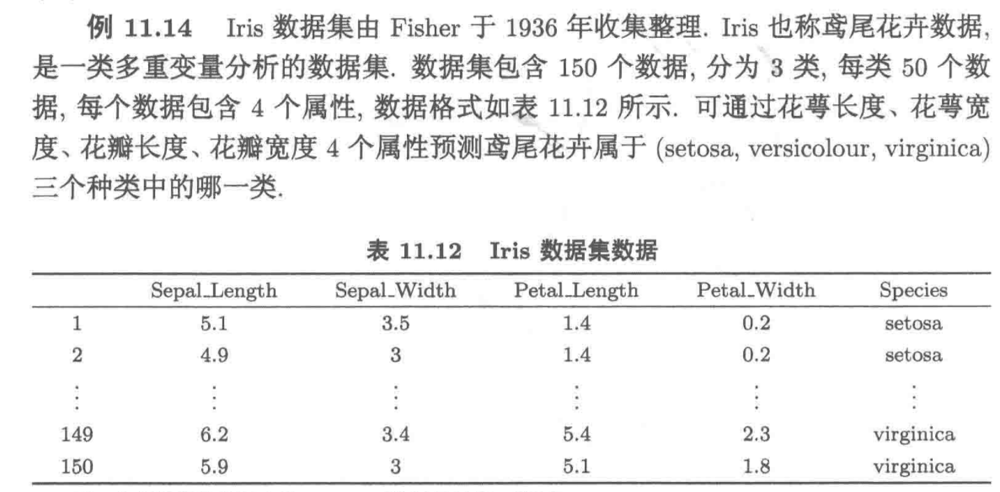

# K-means

一种广泛使用的无监督学习算法，主要用于将数据集分成若干个簇（cluster）。它的目标是通过最小化簇内数据点的差异，使得相似的对象被分到同一个簇中，而不同簇的对象尽可能不相似。

## 原理

以简单的二维数据为例，如下：

```txt
有数据

1 2 3    6 7 8    10 11 12

step1：我们通过肉眼观察确定簇的个数(K)，为3
step2：随机取K个点为中心点

1 2 3    6 7 8    10 11 12
↑   ↑    ↑

step3：计算每个点到中心点的距离，并把离的近的归一类

(1 2) (3) (6 7 8 10 11 12)
 ↑     ↑   ↑
 
step4：将中心点移动到每个簇的最中心

(1 2) (3) (6 7 8 10 11 12)
 ↑     ↑         ↑
 
step5：重复step3

(1 2) (3 6 7) (8 10 11 12)
 ↑     ↑         ↑
 
step6：重复step4

(1 2) (3 6 7) (8 10 11 12)
 ↑       ↑       ↑
 
step7：重复step3

(1 2 3) (6 7 8) (10 11 12)
 ↑       ↑       ↑
 
step8：重复step4

(1 2 3) (6 7 8) (10 11 12)
   ↑       ↑        ↑
   
完成
```

## 图解




<script setup>
  import KMeans from './components/KMeans.vue'
</script>

<KMeans />

